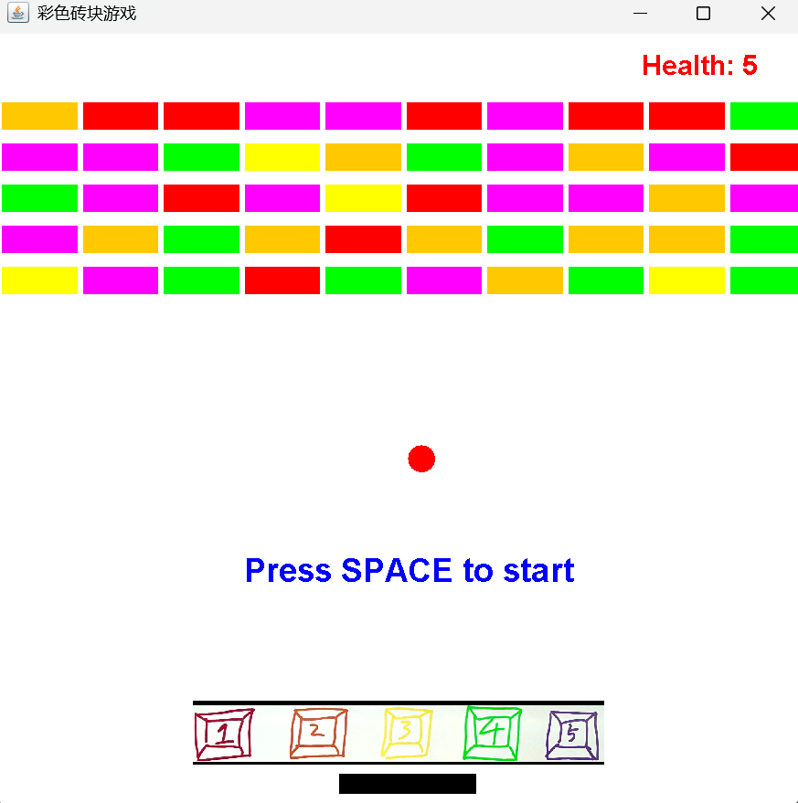

# 📌 Brick Bounce

## 🧑‍🤝‍🧑 Team A
- 武梓彤（Bianca）
- 曾会涵（Melody Zeng）
- 张若颖（Bella）
- 朱韵冰（Miranda Zhu）

## 📖 Project Description
Crazy version of the brick bounce game. The player must press keys 1–5 to switch the ball’s color. Only bricks with the same color can be destroyed. Hitting a wrong-colored brick causes the player to lose health, while breaking the correct one restores it. 
- Erjie loves the music.

## 🖼️ Screenshot

---

© 2024-2025 Team A. All rights reserved.
This project was created as part of the AP Computer Science A 2024-2025 school year, AP Division Shenghua Zizhu Academy.

