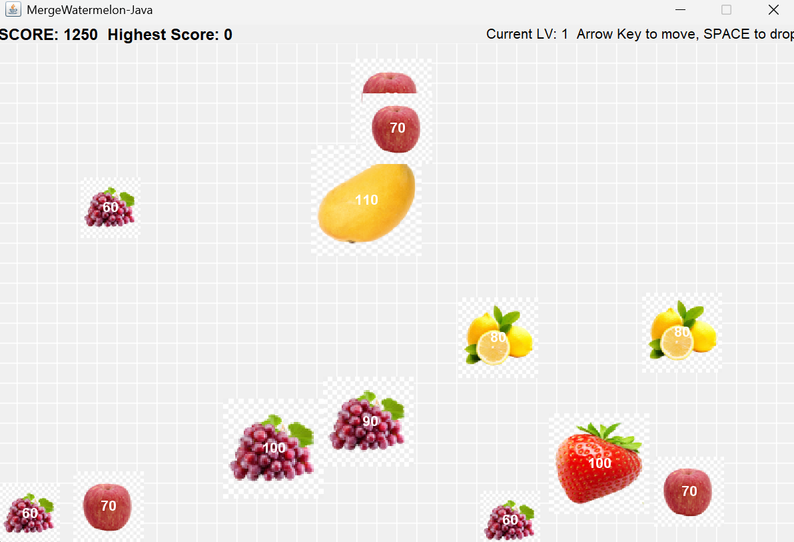

# 📌 Merge Watermelon

## 🧑‍🤝‍🧑 Team B
- 马斌（Eric Ma）
- 王司丞（Allen Wang）

## 📖 Project Description
Inspired by the popular "Big Watermelon" game, this project simulates fruit merging with realistic physics — including gravity, bouncing, and collision. Players drop fruits that merge into larger ones when identical fruits touch. 
- WARNING! The game’s behavior can be **unpredictable**, with bugs emerging from complex interactions — but that’s part of its charm.

## 🖼️ Screenshot

---

© 2024-2025 Team B. All rights reserved.
This project was created as part of the AP Computer Science A course, 2025 Spring at AP Division Shenghua Zizhu Academy.

