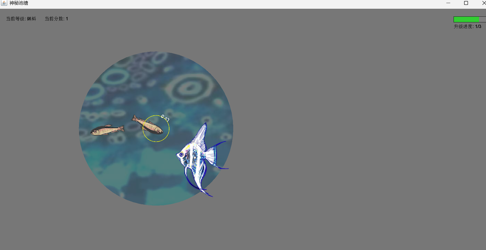

# 📌 Dragon Pond

## 🧑‍🤝‍🧑 Team G
- 蔡瑞婉（Enna Cai）
- 陈一鹭（Cathy Chen）
- 陆韵婕（Barry Lu）
- 吴思燕（Alice Wu）
- 应伊诺（Yino Ying）

## 📖 Project Description
Dragon Pond is a survival and evolution game made in Java. You swim around a magical pond, using the mouse to turn and WASD to speed up. By eating and merging smaller creatures, you grow stronger and aim to summon the dragon. But there’s a twist — you can only see a limited area around you, and strong predators will chase you if you get too close.

- HOW TO RUN
```bash
java .\src\DragonPondGame.java
```

## 🖼️ Screenshot



---

© 2024-2025 Team G. All rights reserved.
This project was created as part of the AP Computer Science A course, 2025 Spring at AP Division Shenghua Zizhu Academy.

