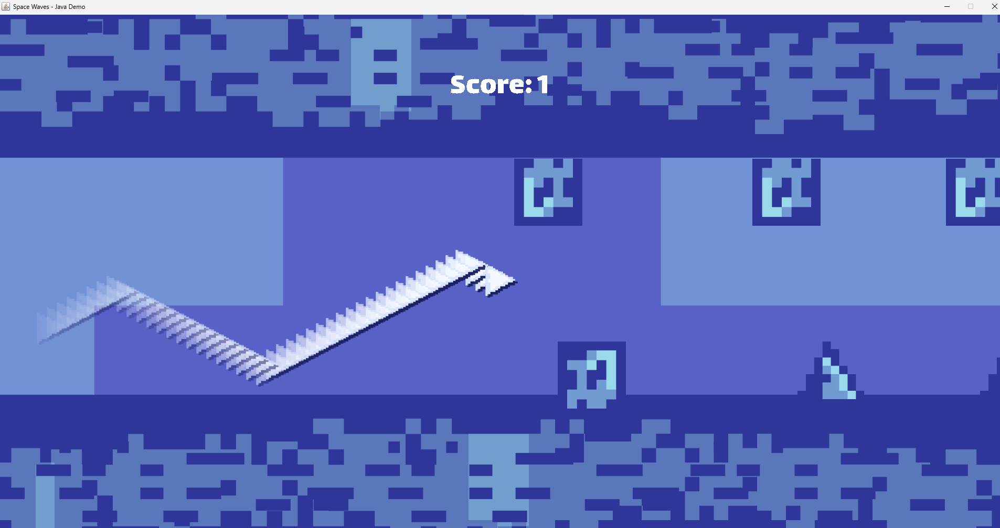

# 📌 Space Wave

## 🧑‍🤝‍🧑 Team C
- 陈立（Sandy Chen）
- 王啸宸（Lucas）
- 杨顺翔（Zachary Yang）

## 📖 Project Description
In this fast-paced space shooter, the player rides a wave through space while dodging obstacles and destroying spinning gears. Press F to shoot bullets and eliminate threats ahead, and use the spacebar to reverse direction instantly. Timing your turns and shots is key to survival. The game blends simple controls with reactive gameplay, offering a fun challenge with smooth movement and visual rhythm.

## 🖼️ Screenshot

---

© 2024-2025 Team C. All rights reserved.
This project was created as part of the AP Computer Science A class 2024-2025, AP Division, Shenghua Zizhu Academy.

